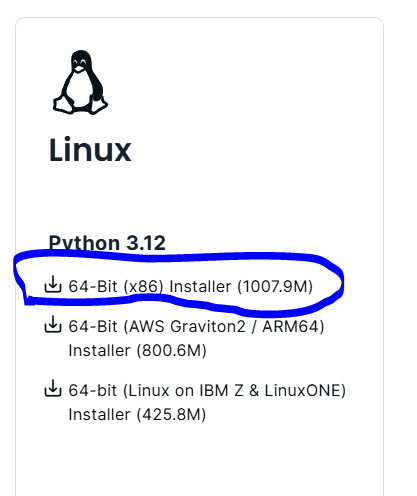

# Download anaconda

https://www.anaconda.com/download/success

# Start Ubuntu on Windows (Windows Subsystem for Linux)
wsl -d Ubuntu

# Ke download folder, lalu install Python & Anaconda
sudo apt install python3-pip
bash Anaconda3-2024.06-1-Linux-x86_64.sh -b -u -p ~/anaconda3
cd ~
ls (Cek anaconda3 directory ada atau nggak)

~/anaconda3/bin/conda init bash
~/anaconda3/bin/conda init zsh
#reopen ubuntu

# Install Required Package With Conda env
conda create --name unsloth_env \
    python=3.10 \
    pytorch \
    cudatoolkit=11.8 \
    xformers \
    -c pytorch -c nvidia -c xformers \
    -y

conda activate unsloth_env                  

## (Make sure udah dalam env untuk install package selanjutnya)
pip install "unsloth[colab-new] @ git+https://github.com/unslothai/unsloth.git" 
pip install --no-deps "xformers<0.0.27" "trl<0.9.0" peft accelerate bitsandbytes
pip install transformers -U
conda install chardet
pip install flask

# Create virtual environment
virtualenv aic_env

# Activate env
aic_env\Scripts\activate

# Install Torch
pip install torch torchvision torchaudio --index-url https://download.pytorch.org/whl/cu118

# Install Unsloth
pip install "unsloth[cu118-torch230] @ git+https://github.com/unslothai/unsloth.git"

# Kalo install unsloth error
pip install --upgrade pip

# Troubleshoot Unsloth (All harus berhasil)
nvcc
python -m xformers.info
python -m bitsandbytes

